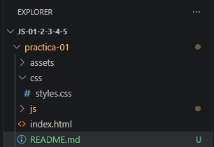
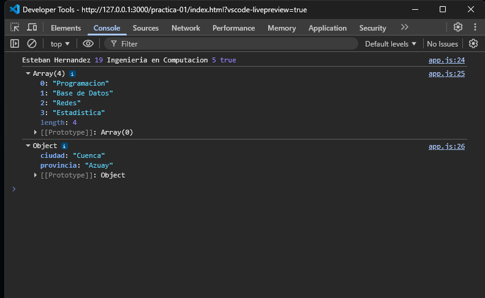
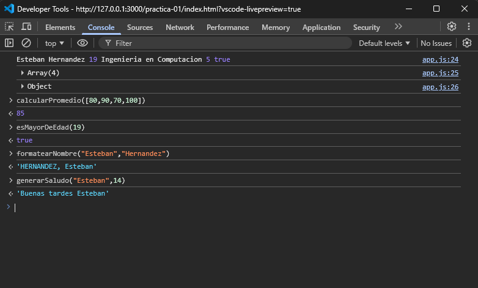
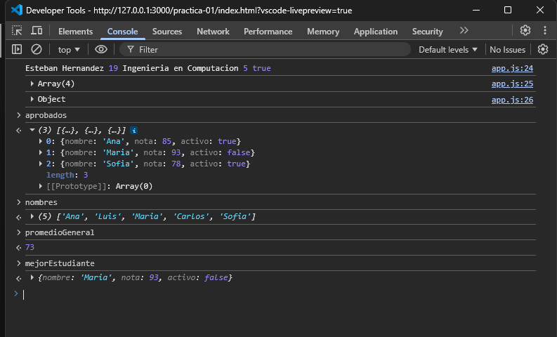
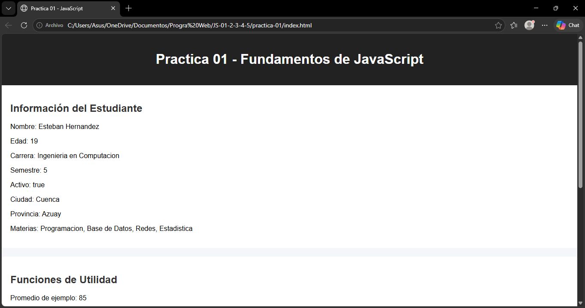
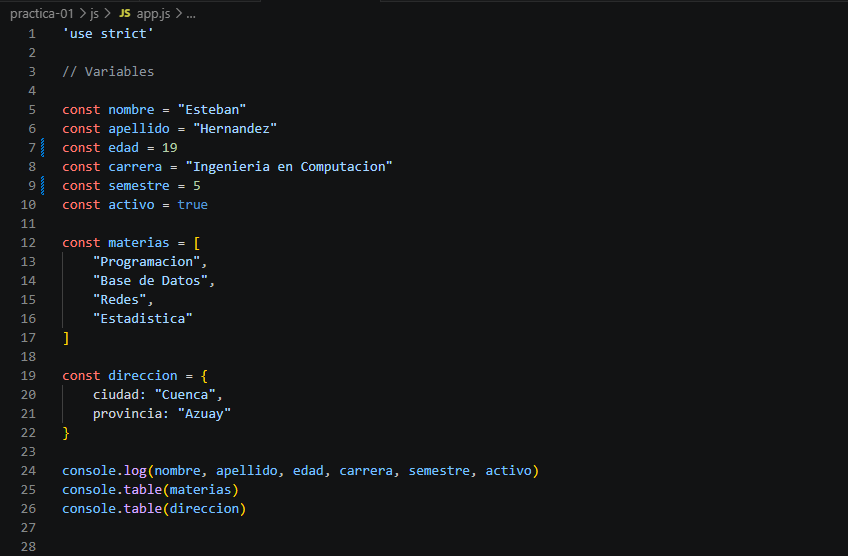
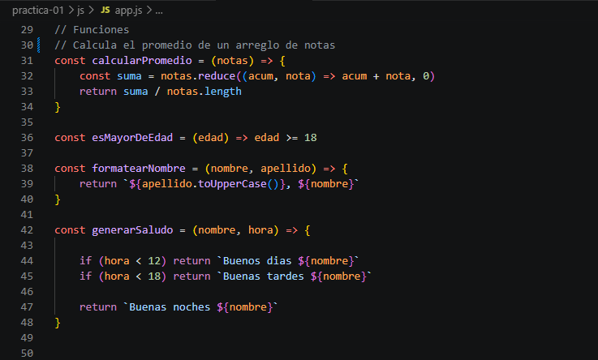
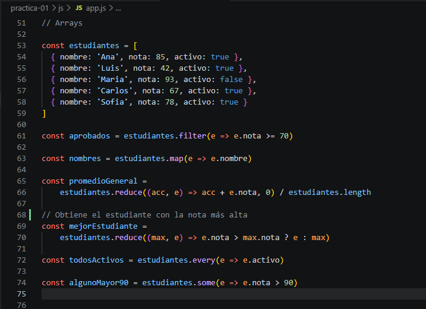
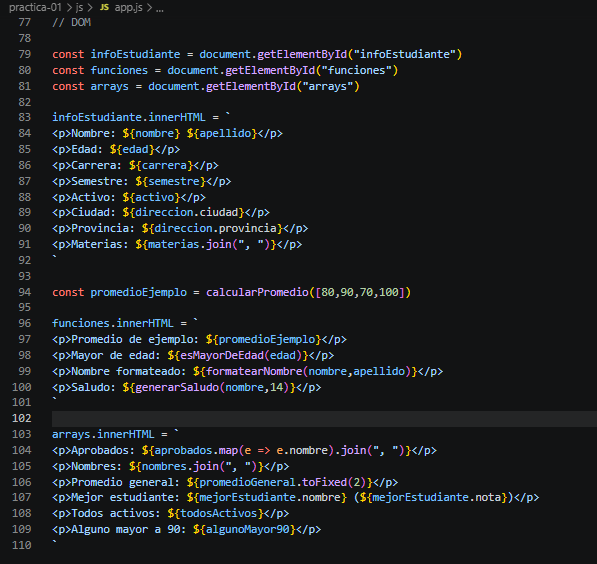

# Practica JavaScript - Sintaxis
## **Estructura del Proyecto**
Captura del explorador de archivos mostrando la organizacion de carpetas y archivos.

  

## **Consola del Navegador**
Captura mostrando la salida de la informacion del estudiante, el array (Materias) y object (Dirección).

  

## **Funciones**
Captura de la consola mostrando el retorno de las funciones: calcularPromedio(), esMayorDeEdad(), formatearNombre() y generarSaludo().

  

## **Arrays**
Captura mostrando los resultados de filter, map, reduce

  

## **Página renderizada**
Captura del navegador mostrando los resultados en el HTML

  

## Código fuente
### Capturas del archivo app.js completo

#### **Sección de variables**

  

#### **Sección de funciones**

  

#### **Sección de arrays**

  

#### **Sección del DOM**

  

