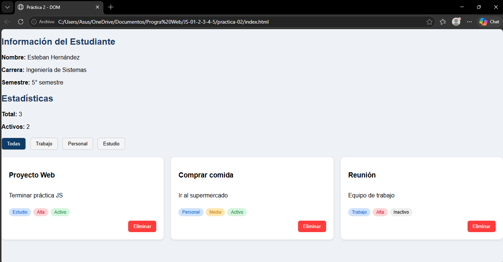
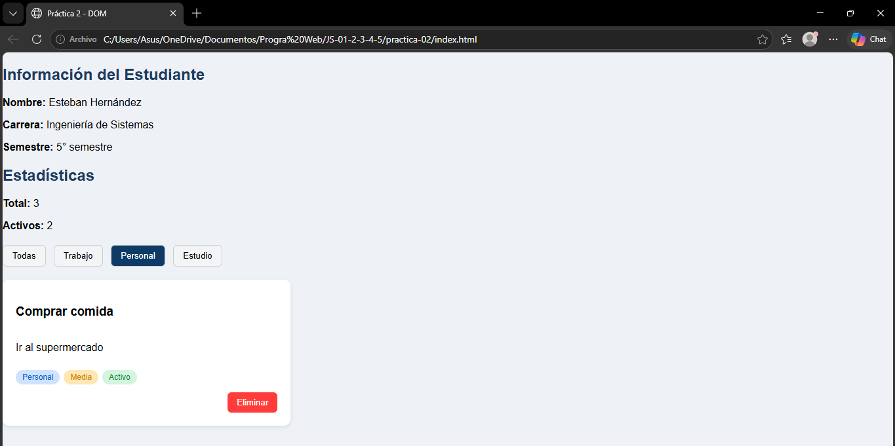

# Practica JavaScript - Renderizado y Manipulación del DOM

## Descripción de la solución
En esta práctica se desarrolló una aplicación web simple utilizando HTML, CSS y JavaScript, cuyo objetivo es mostrar la información del estudiante y una lista de elementos organizados en tarjetas.

La aplicación permite:

- Mostrar informacion del estudiante.
- Renderizar dinámicamente una lista de elementos.
- Eliminar elementos de la lista.
- Filtrar elementos por categoría.
- Mostrar estadísticas de los elementos.
- Aplicar estilos visuales utilizando CSS Grid y diseño responsivo.

Para la interfaz se implementaron cards que muestran la información de cada elemento, incluendo título, estado, descripción, categoría y prioridad.

El diseño se realizó con un enfoque responsive mobile-first, permitiendo que la interfaz se adapte correctamente a diferentes tamaños de pantalla.

## Estilos CSS implementados
Para lograr un diseño visual claro y organizado se aplicaron los siguientes estilos:

- Layout con CSS Grid para organizar las tarjetas.
- Hover effects para dar interacción visual a las tarjetas.
- Botón de eliminar en color rojo para identificar fácilmente la acción.
- Filtros activos resaltados mediante cambio de color.
- Responsive design básico mediante media queries.

### Ejemplo del layout con CSS Grid:
```css
#contenedor-lista{
  display:grid;
  gap:20px;
  grid-template-columns:1fr;
}
```

### Responsive design aplicado:
```css
@media (min-width:40rem){
  #contenedor-lista{
    grid-template-columns:1fr 1fr;
  }
}

@media (min-width:64rem){
  #contenedor-lista{
    grid-template-columns:1fr 1fr 1fr;
  }
}
```

Esto permite que:
- En celulares se muestre 1 tarjeta por fila
- En tablets 2 tarjetas
- En pantallas grandes 3 tarjetas

## Ejemplo de funciones principales
### Renderizado de la lista
La función `renderizarLista()` se encarga de crear dinámicamente las tarjetas y mostrarlas en el HTML.

```javascript
function renderizarLista(datos) {
  const contenedor = document.getElementById('contenedor-lista');
  contenedor.innerHTML = '';

  const fragment = document.createDocumentFragment();

  datos.forEach(el => {

    const card = document.createElement('div');
    card.classList.add('card');

    const titulo = document.createElement('h3');
    titulo.textContent = el.titulo;

    const descripcion = document.createElement('p');
    descripcion.textContent = el.descripcion;

    card.appendChild(titulo);
    card.appendChild(descripcion);

    fragment.appendChild(card);
  });

  contenedor.appendChild(fragment);
}
```

Esta función permite generar las tarjetas de forma dinámica utilizando manipulación del DOM.

### Eliminación de elementos
La función `eliminarElemento()` elimina un elemento de la lista utilizando su id.

```javascript
function eliminarElemento(id) {
  const index = elementos.findIndex(el => el.id === id);

  if (index !== -1) {
    elementos.splice(index, 1);
    renderizarLista(elementos);
  }
}
```

Después de eliminar el elemento, se vuleve a renderizar la lista para actualizar la interfaz.

### Filtrado de elementos
Los filtros permiten mostrar únicamente los elementos que pertenecen a una categoría específica.

```javascript
function inicializarFiltros() {
  const botones = document.querySelectorAll('.btn-filtro');

  botones.forEach(btn => {
    btn.addEventListener('click', () => {

      const categoria = btn.dataset.categoria;

      if (categoria === 'todas') {
        renderizarLista(elementos);
      } else {
        const filtrados = elementos.filter(e => e.categoria === categoria);
        renderizarLista(filtrados);
      }

    });
  });
}
```

Esto permite que el usuario pueda visualizar únicamente los elementos de una categoría seleccionada.

## Capturas del funcionamiento
### **Vista general de la aplicación**
<p align="center">
  
</p>

### **Filtrado aplicado**
<p align="center">
  
</p>
