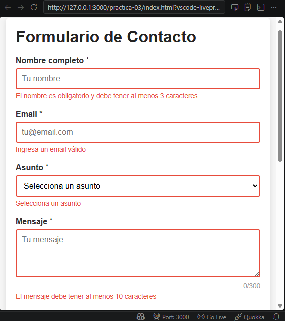
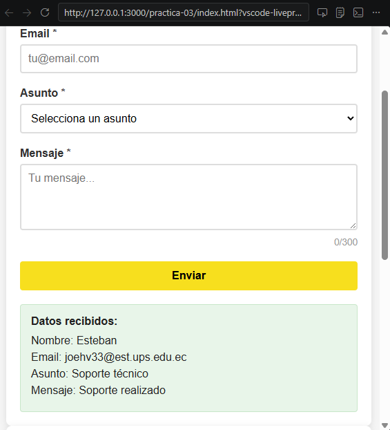
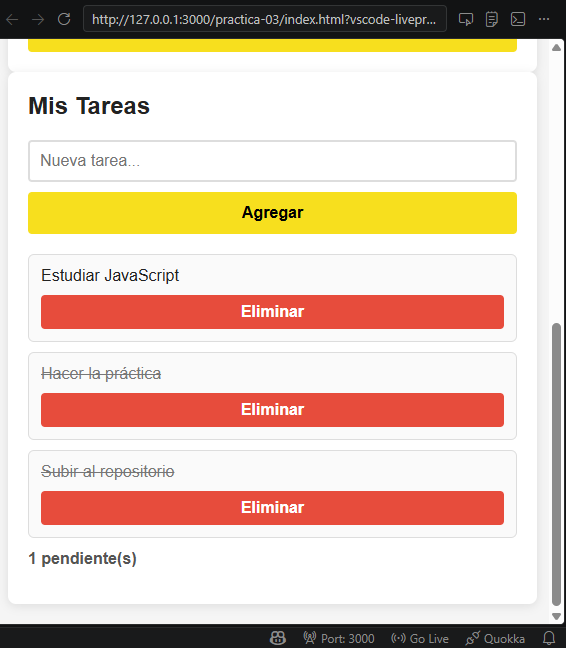
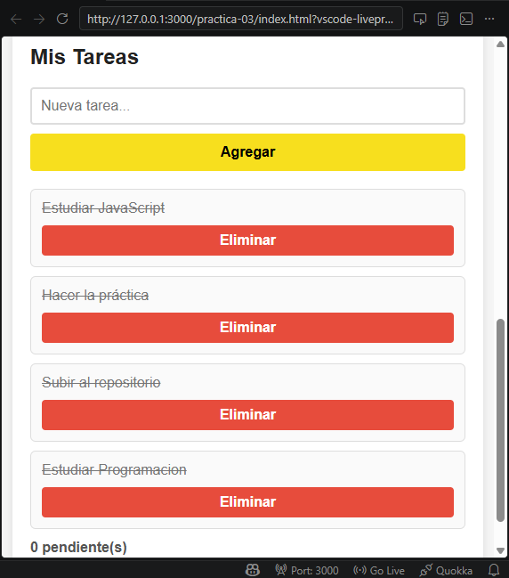

# Practica JavaScript - Eventos

## Descripción de la solución
Este proyecto consiste en una aplicación web desarrollada en HTML, CSS, JavaScript que impelenta dos funcionalidades principales:

### 1. Formulario de contacto con validación dinámica  
- Validación de campos obligatorios (nombre, email, asunto y mensaje).
- Validación de email mediante expresión regular.
- Contador de caracteres para el mensaje.
- Manejo de envío de formulario con `preventDefault()`.
- Mostrar los datos ingresados en pantalla sin recargar la página web.
### 2. Lista de tareas interactivas 
- Permite agregar, eliminar, crear y marcar tareas como completadas.
- Uso de event delegation para manejar eventos en elementos dinámicos.
- Actualización automática del contador de tareas pendientes.
- Manejo de eventos de teclado para mejorar la experiencia de usuario.

El proyecto demuestra el uso de:
- Manipulación del DOM 
- Manejo de eventos
- Validación de formularios
- Delegación de eventos
- Manejos de arrays con JavaScript

## Código destacado
### Validación del formulario con `preventDefault()`
Se evita el comportamiento por defecto del formulario para validar los datos antes enviados.

```javascript
formulario.addEventListener('submit', (e) => {
  e.preventDefault();

  const nombreValido = validarNombre();
  const emailValido = validarEmail();
  const asuntoValido = validarAsunto();
  const mensajeValido = validarMensaje();

  if (nombreValido && emailValido && asuntoValido && mensajeValido) {
    mostrarResultado();
    resetearFormulario();
    return;
  }
});
```

Esta lógica permite controlar manualmente el envio del formulario y mostrar mensajes de error cuando sea necesario.

## Event Delegation en la lista de tareas
Se utiliza delegación de eventos para manejar clics en elementos dinámicos dentro de la lista.

```javascript
listaTareas.addEventListener('click', (e) => {
  const action = e.target.dataset.action;

  if (!action) return;

  const item = e.target.closest('li');
  const id = Number(item.dataset.id);

  if (action === 'eliminar') {
    tareas = tareas.filter((tarea) => tarea.id !== id);
    renderizarTareas();
  }

  if (action === 'toggle') {
    const tarea = tareas.find((t) => t.id === id);
    if (tarea) {
      tarea.completada = !tarea.completada;
      renderizarTareas();
    }
  }
});
```
Esto permite manejar múltiples acciones desde un solo escuchador.

## Atajo de teclado con `ctrl + Enter`
Se impelmenta un atajo para enviar el formulario usando el teclado

```javascript
document.addEventListener('keydown', (e) => {
  if (e.ctrlKey && e.key === 'Enter') {
    e.preventDefault();
    formulario.requestSubmit();
  }
});
```
Este atajo mejora la accesibilidad y la experiencia del usuario.

## Capturas
### Validación en acción

### Formulario procesado

### Event delegation funcionando

### Contador de tareas actualizado

### Tareas completadas
