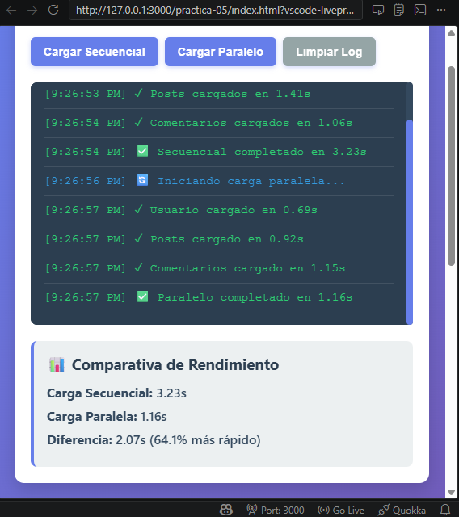
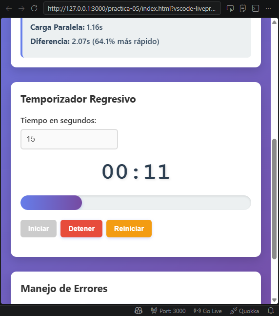
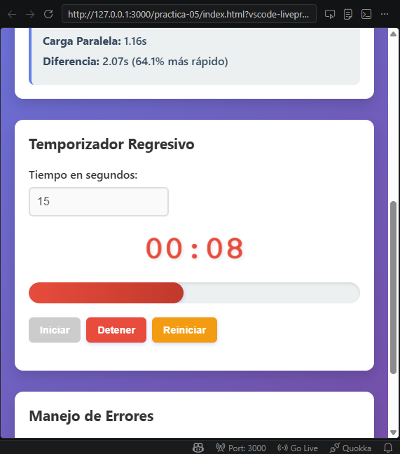
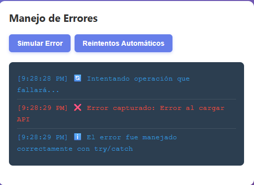
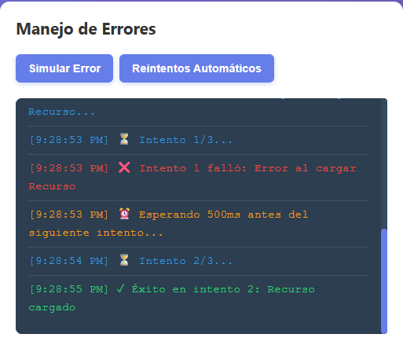

# Practica JavaScript - Simulador de Asincronía
## Descripcion del simulador implementado
Este proyecto consiste en un simulador de operaciones asincrónicas en JavaScript que permite visualizar como funcionan las promesas, `async/await`, temporizadores y manejo de errores.

La aplicación incluye tres funcionalidades principales:

### Simulador de carga de recursos
Permite comparar el tiempo de ejecución entre dos estrategias:
- **Carga secuencial:** las peticiones se ejecutan una después de otra.
- **Carga paralela:** todas las peticiones se ejecutan al mismo tiempo usando `Promise.all()`.

El sistema muestra un log en tiempo real y una comparativa de rendimiento entre ambas estrategias.

### Temporizador regresivo 
Se implementa un temporizador que:
- Permite ingresar el tiempo en segundos.
- Muestra el tiempo restante en formato **MM:SS**.
- Actualiza una barra de progreso.
- La barra cambia de color cuando quedan 10 segundos o menos.
- Utiliza `setInterval()` para actualizar cada segundo.

### Simulación de errores y reintentos
Se implementa un sistema para demostrar:
- Manejo de errores con `try/catch`.
- Simulación de fallos en promesas.
- Reintentos automáticos con **backoff exponecial**.

Esto permite observar como manejar errores en aplicaciones asincrónicas.

### Análisis: Carga secuencial vs Carga paralela
Cuando las peticiones se ejecutan secuencialmente, cada operación espera que termine la anterior antes de comenzar.

#### **Ejemplo:** 

`Usuario -> Posts -> Comentarios`

El tiempo total es aproximadamente la suma de todos los tiempos de carga.

#### En cambio, cuando se ejecutan en paralelo, todas las peticiones se lanzan al mismo tiempo:

`Usuario`

`Posts`

`Comentarios`

El tiempo total se aproxima al tiempo de la petción más lenta. Por esta razón, la carga paralela suele ser considerablemente más rápida, especialmente cuando se realizan múltiples solicitudes independientes.

## Código destacado
### Función que retorna una promesa con `setTimeout`
Esta función simula una petición asincrónica con un tiempo aleatorio de respuesta.

```javascript
function simularPeticion(nombre, tiempoMin = 500, tiempoMax = 2000, fallar = false) {
  return new Promise((resolve, reject) => {
    const tiempoDelay = Math.floor(Math.random() * (tiempoMax - tiempoMin + 1)) + tiempoMin;

    setTimeout(() => {
      if (fallar) {
        reject(new Error(`Error al cargar ${nombre}`));
      } else {
        resolve({
          nombre,
          tiempo: tiempoDelay,
          timestamp: new Date().toLocaleTimeString()
        });
      }
    }, tiempoDelay);
  });
}
```

Esta función se usa para simular llamadas a APIs o recursos externos.

### Carga secuencial con `await`
En este caso cada petición espera a que la anterior termine.
```javascript
async function cargarSecuencial() {
  const usuario = await simularPeticion('Usuario', 500, 1000);
  const posts = await simularPeticion('Posts', 700, 1500);
  const comentarios = await simularPeticion('Comentarios', 600, 1200);
}
```

Esto genera un tiempo total mayor porque las operaciones no se ejecutan simultáneamente.

### Carga paralela con `Promise.all`
Aqui todas las promesas se ejecutan al mismo tiempo. `Promise.all()` espera a que todas las promesas se resuelvan, lo que reduce el timepo total.

```javascript
async function cargarParalelo() {
  const promesas = [
    simularPeticion('Usuario', 500, 1000),
    simularPeticion('Posts', 700, 1500),
    simularPeticion('Comentarios', 600, 1200)
  ];

  const resultados = await Promise.all(promesas);
}
```

### Manejo de errores con `try/catch`
Se utiliza para capturar errores producidos por promesas rechazadas.

```javascript
async function simularError() {
  try {
    await simularPeticion('API', 500, 1000, true);
  } catch (error) {
    mostrarLogError(`Error capturado: ${error.message}`, 'error');
  }
}
```

Esto evita que la aplicación se detenga y permite mostrar el error al usuario.

### Temporizador con `setInterval`
El temporizador utiliza `setInterval` para ejecutar código cada segundo. Este mecanismo permite actualizar continuamente el tiempo restante y la barra de progreso.

```javascript
intervaloId = setInterval(() => {
  tiempoRestante--;
  actualizarDisplay();

  if (tiempoRestante <= 0) {
    detener();
  }
}, 1000);
```

## Capturas
### Comparativa secuencial vs paralelo con tiempos

### Temporizador funcionando con barra de progreso (Antes de llegar a 10 segundos)

### Temporizador funcionando con barra de progreso (Despues de llegar a 10 segundos)

### Error capturado y mostrado en UI (try/catch)

### Reintentos Automáticos
