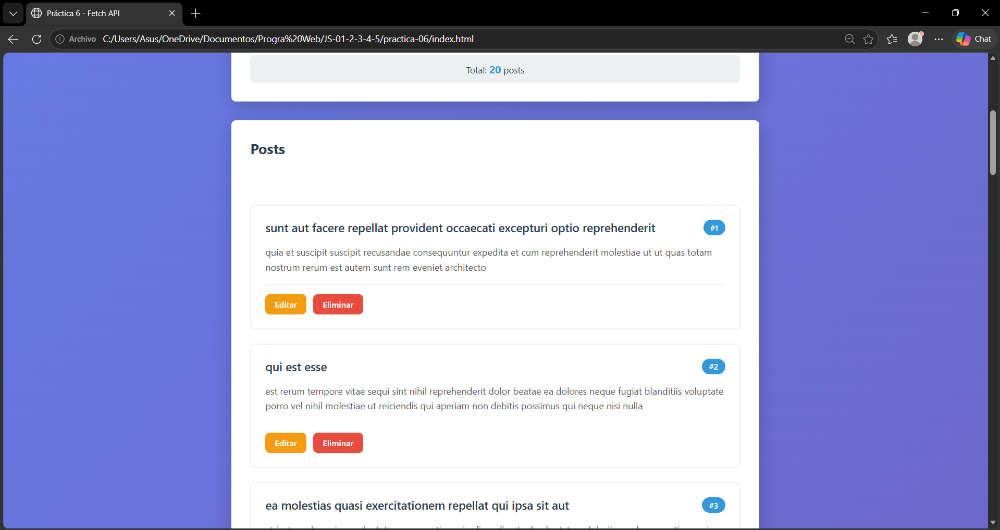
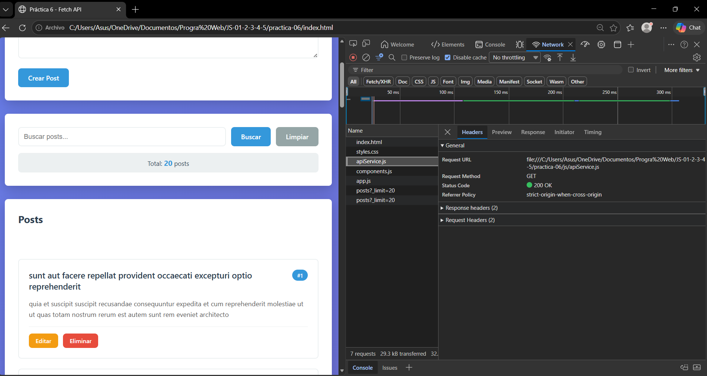
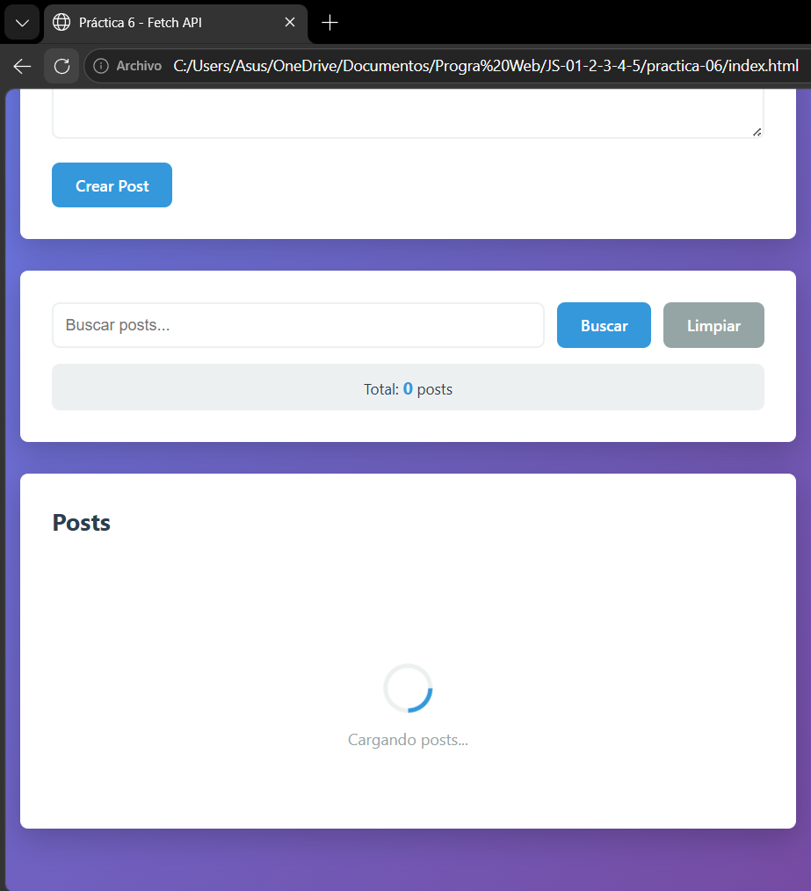
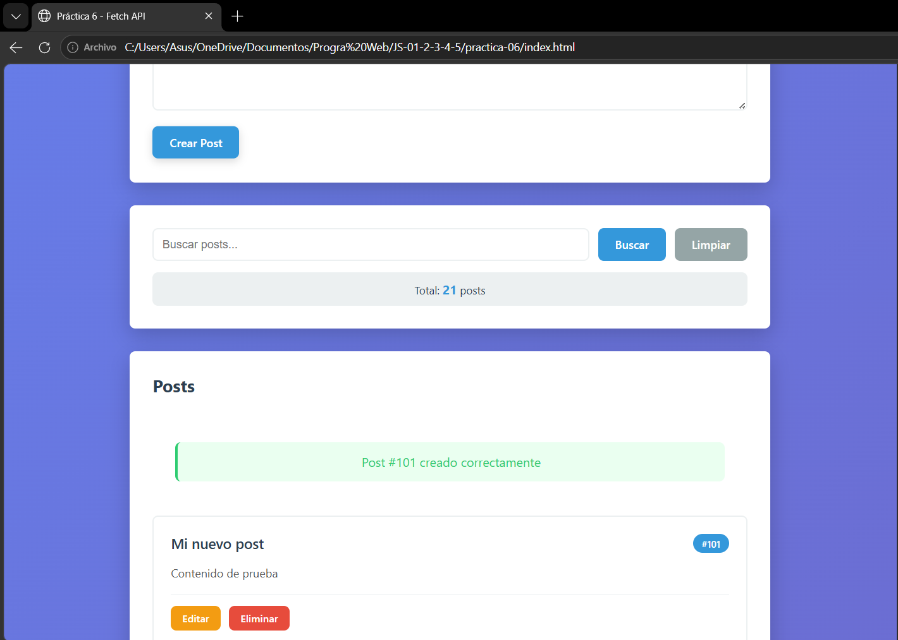
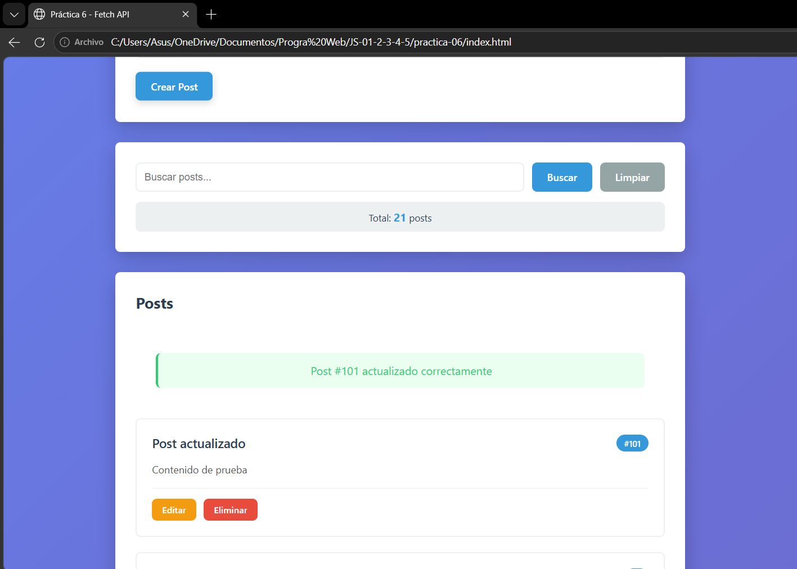
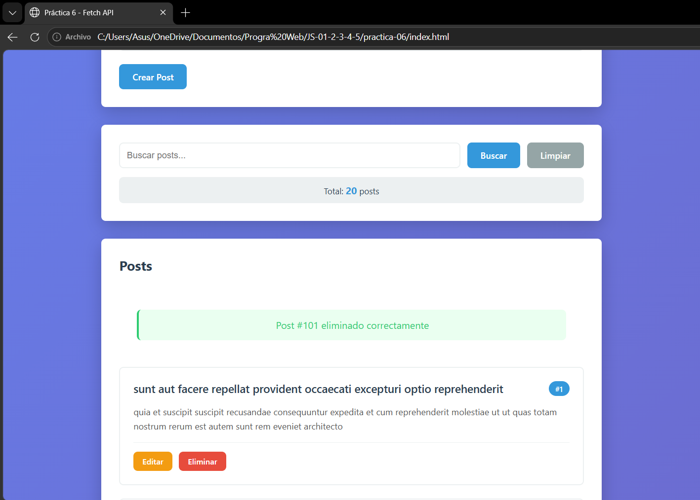
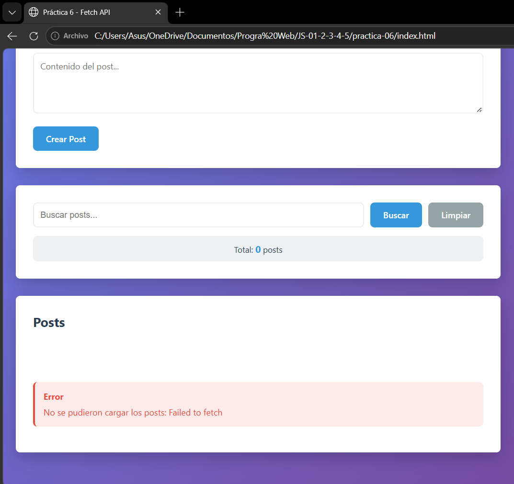

# Practica JavaScript - Fetch API
## Resultados y evidencias:

### 1. Lista cargada - Datos de la API renderizados en la pagina
<p align="center">
  
</p>

**Descripción:** Se obtienen registros desde la API mediante la peticion GET usando fetch, y se renderizan dinámicamente en la interfaz.

### 2. DevTools Network - Pestaña Network mostrando las peticiones HTTP
<p align="center">
  
</p>

**Descripción:** Se visualizan las peticiones HTT (en este caso la peticion GET) realizadas por la aplicación.

### 3. Spinner - Estado de carga visible
<p align="center">
  
</p>

**Descripción:** Se muestra un indicador visual de carga mientras se esperan los datos de la API.

### 4. Crear - Post enviado, nuevo item en la lista
<p align="center">
  
</p>

**Descripción:** Se realiza una petición POST para crear un nuevo recurso y se actualiza la interfaz de usuario de forma dinámica.

### 5. Editar - Post modificado visible
<p align="center">
  
</p>

**Descripción:** Se utiliza una petición POST para modificar un recurso existente.

### 6. Eliminar - Item removido
<p align="center">
  
</p>

**Descripción:** Se ejecuta una petición DELETE y se actualiza la lista en tiempo real.

### 7. Error - Mensaje de error al fallar una peticion
<p align="center">
  
</p>

**Descripción:** Se captura el error `Failed to fetch` y se muestra al usuario mediante componentes visuales.

### 8. Codigo - Capturas del servicio API y componentes
#### 8.1 Capturas del servicio API
#### 8.1.1 GET - Obtener todos los posts (con límite opcional)
```javascript
async getPosts(limit = 10) {
    return this.request(`/posts?_limit=${limit}`);
},
```
**Descripción:** Realiza una petición GET al endpoint `/posts` y devuelve una lista de posts. Permite limitar la cantidad de resultados mediante el parámetro `limit`.

#### 8.1.2 GET - Obtener un post por ID
```javascript
async getPostById(id) {
    return this.request(`/posts/${id}`);
},  
```
**Descripción:** Realiza una petición GET al endpoint `/posts/{id}` para obtener la información de un post específico según su identificador.

#### 8.1.3 POST - Crear un nuevo post
```javascript
async createPost(postData) {
    return this.request('/posts', {
        method: 'POST',
        body: JSON.stringify(postData)
    });
},  
```
**Descripción:** Envía una petición POST al endpoint `/posts` con los datos del post en formato JSON para crear un nuevo recurso en la API.

#### 8.1.4 PUT - Actualizar un post completo
```javascript
async updatePost(id, postData) {
    return this.request(`/posts/${id}`, {
        method: 'PUT',
        body: JSON.stringify(postData)
    });
},
```
**Descripción:** Realiza una petición PUT al endpoint `/posts/{id}` enviando los nuevos datos del post para reemplazar completamente el recurso existente.

#### 8.1.5 DELETE - Eliminar un post
```javascript
async deletePost(id) {
    return this.request(`/posts/${id}`, {
        method: 'DELETE'
    });
},
```
**Descripción:** Envía una petición DELETE al endpoint `/posts/{id}` para eliminar el post correspondiente de la API.

#### 8.1.6 GET - Buscar posts por userId
```javascript
async getPostsByUser(userId) {
    return this.request(`/posts?userId=${userId}`);
}
```
**Descripción:** Realiza una petición GET filtrando los posts por `userid`, devolviendo únicamente los posts asociados a ese usuario.

#### 8.2 Capturas de componentes
#### 8.2.1 Componente para renderizar una tarjeta de post
```javascript
function PostCard(post) {
  const article = document.createElement('article');
  article.className = 'post-card fade-in';
  article.dataset.id = post.id;

  const header = document.createElement('div');
  header.className = 'post-card-header';

  const title = document.createElement('h3');
  title.className = 'post-card-title';
  title.textContent = post.title;

  const badge = document.createElement('span');
  badge.className = 'post-card-id';
  badge.textContent = `#${post.id}`;

  header.appendChild(title);
  header.appendChild(badge);

  const body = document.createElement('p');
  body.className = 'post-card-body';
  body.textContent = post.body;

  const footer = document.createElement('div');
  footer.className = 'post-card-footer';

  const btnEditar = document.createElement('button');
  btnEditar.className = 'btn-editar';
  btnEditar.textContent = 'Editar';
  btnEditar.dataset.action = 'editar';
  btnEditar.dataset.id = post.id;

  const btnEliminar = document.createElement('button');
  btnEliminar.className = 'btn-eliminar';
  btnEliminar.textContent = 'Eliminar';
  btnEliminar.dataset.action = 'eliminar';
  btnEliminar.dataset.id = post.id;

  footer.appendChild(btnEditar);
  footer.appendChild(btnEliminar);

  article.appendChild(header);
  article.appendChild(body);
  article.appendChild(footer);

  return article;
}
```
**Descripción:** Construye dinámicamente un elemento `<article>` con título, contenido y botones (editar/eliminar) usando la API del DOM.

#### 8.2.2 Componente de spinner de carga
```javascript
function Spinner() {
  const container = document.createElement('div');
  container.className = 'loading';

  const spinner = document.createElement('div');
  spinner.className = 'spinner';

  const texto = document.createElement('p');
  texto.textContent = 'Cargando posts...';

  container.appendChild(spinner);
  container.appendChild(texto);

  return container;
}
```
**Descripción:** Genera un indicador visual animado que s emeustra mientras se están obteniendo datos de la API.

#### 8.2.3 Componente de mensaje de error
```javascript
function MensajeError(mensaje) {
  const container = document.createElement('div');
  container.className = 'error';

  const titulo = document.createElement('strong');
  titulo.textContent = 'Error';

  const texto = document.createElement('p');
  texto.textContent = mensaje;

  container.appendChild(titulo);
  container.appendChild(texto);

  return container;
}
```
**Descripción:** Crea un contenedor visual para mostrar errores porvenientes de peticiones HTTP o validaciones de la aplicación.

#### 8.2.4 Componente de mensaje de éxito
```javascript
function MensajeExito(mensaje) {
  const container = document.createElement('div');
  container.className = 'success';

  const texto = document.createElement('p');
  texto.textContent = mensaje;

  container.appendChild(texto);
  return container;
}
```
**Descripción:** Muestra una notificación visual indicando que una operación (crear, editar, eliminar) se completó correctamente.

#### 8.2.5 Renderiza la lista de posts en el DOM
```javascript
function renderizarPosts(posts, contenedor) {
  contenedor.innerHTML = '';

  if (posts.length === 0) {
    contenedor.appendChild(EstadoVacio());
    return;
  }

  posts.forEach(post => {
    const postElement = PostCard(post);
    contenedor.appendChild(postElement);
  });
}
```
**Descripción:** Limpia el contenedor y agrega dinámicamente cada post. Si no hay datos, muestra un estado vacío.

#### 8.2.6 Mensaje temporal en la interfaz
```javascript
function mostrarMensajeTemporal(contenedor, elemento, duracion = 3000) {
  contenedor.innerHTML = '';
  contenedor.appendChild(elemento);
  contenedor.classList.remove('oculto');

  if (duracion > 0) {
    setTimeout(() => {
      contenedor.classList.add('oculto');
    }, duracion);
  }
}
```
**Descripción:** Inserta el mensaje en el contendor y lo oculta automáticamente después de un tiempo definido.