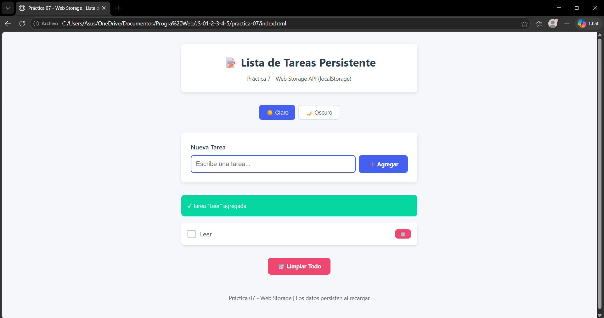
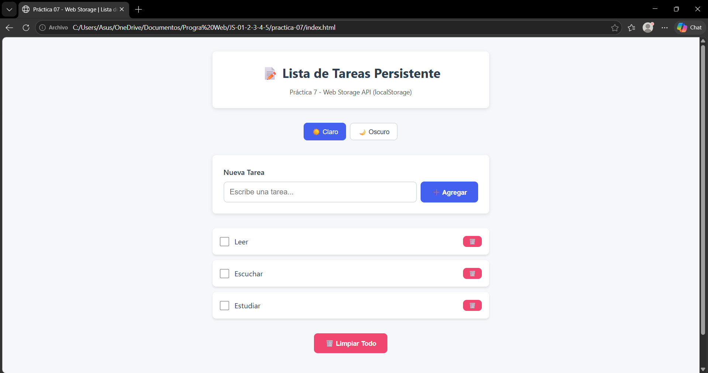
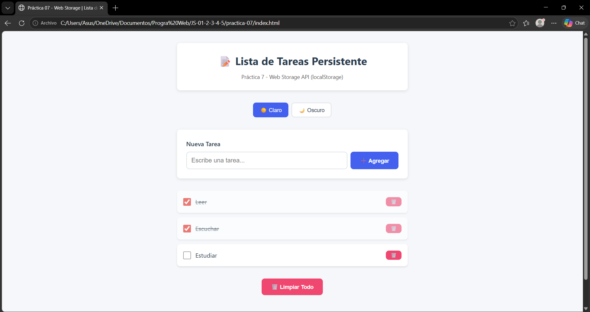
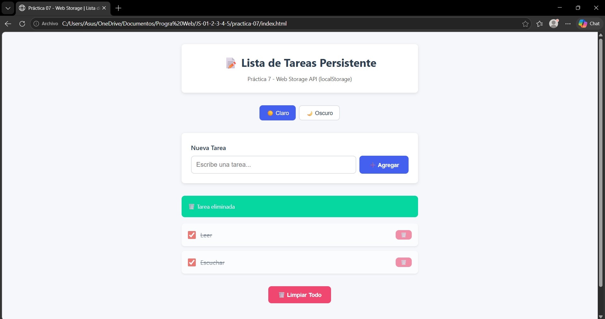
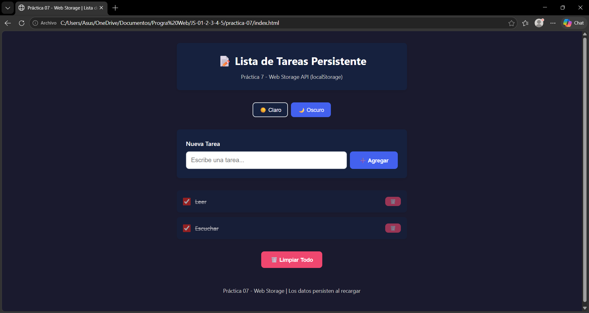
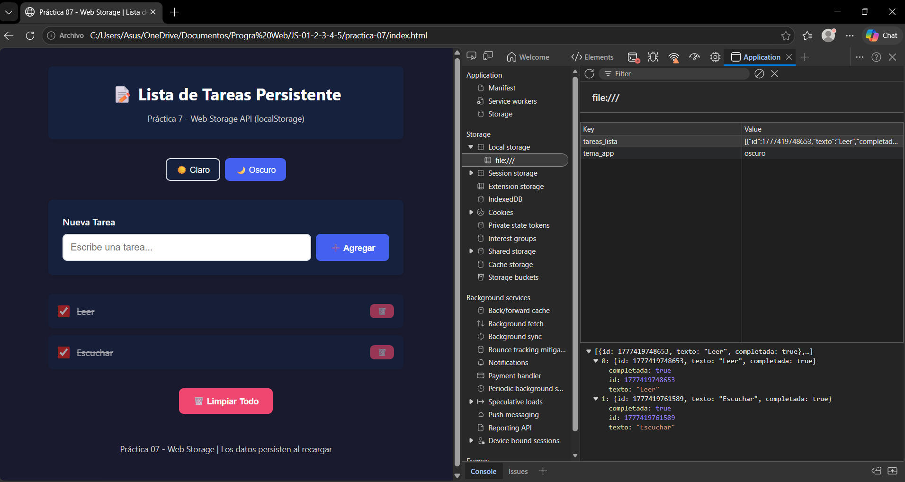
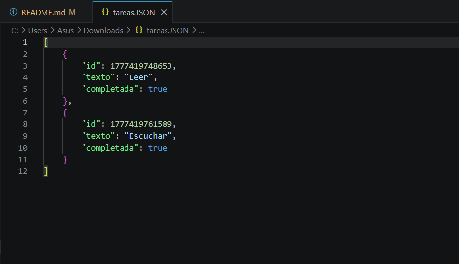

# Practica JavaScript - Storage
## Resultados y evidencias:

### 1. Lista con datos - Items creados y visibles
<p align="center">
  
</p>

**Descripción:** Se muestran varias tareas creadas dinámicamente y renderizadas en la interfaz.

### 2. Persistencia - Recargar pagina y verificar que los datos siguen
<p align="center">
  
</p>

**Descripción:** Los datos permanecen guardados incluso después de recargar la página.

### 3. Edicion - Item siendo editado inline
<p align="center">
  
</p>

**Descripción:** Se muestran varias tareas marcadas como completadas y este cambio visual es gracias al checkbox.

### 4. Eliminar - Item eliminado
<p align="center">
  
</p>

**Descripción:** Una tarea es eliminada correctamente de la lista.

### 5. Tema - Al menos 2 temas diferentes aplicados
<p align="center">
  
</p>

**Descripción:** Se aplican distintos temas modificando variables en el archivo `styles.css`. En este caso el tema cambia de claro a oscuro y viceversa.

### 6. DevTools Application - Pestaña Application > Local Storage mostrando datos
<p align="center">
  
</p>

**Descripción:** Se visualizan las tareas almacenadas en `localStorage`.

### 7. Exportar/Importar - Archivo JSON generado y datos importados
<p align="center">
  
</p>

**Descripción:** Se muestra el archivo JSON generado con los datos importados desde `localStorage`.

### 8. Codigo - Capturas del servicio de Storage
#### 8.1 Lectura de datos desde localStorage
```javascript
getAll() {
  try {
    const datos = localStorage.getItem(this.CLAVE);
    if (!datos) {
      return [];
    }
    return JSON.parse(datos);
  } catch (error) {
    console.error('Error al leer tareas:', error);
    return [];
  }
}
```
**Descripción:** Obtiene todas las tareas de `localStorage`. Si no hay datos, retorna un arreglo vacío y evita errores con `try-catch`.

#### 8.2 Guardado de datos en localStorage
```javascript
guardar(tareas) {
  try {
    localStorage.setItem(this.CLAVE, JSON.stringify(tareas));
  } catch (error) {
    console.error('Error al guardar tareas:', error);
  }
}
```
**Descripción:** Guarda el arreglo de tareas en `localStorage` convirtiéndolo a JSON.

#### 8.3 Creación de nuevas tareas
```javascript
crear(texto) {
  const tareas = this.getAll();

  const nueva = {
    id: Date.now(),
    texto: texto.trim(),
    completada: false
  };

  tareas.push(nueva);

  this.guardar(tareas);

  return nueva;
}
```
**Descripción:** Crea una nueva tarea con ID único, la agrega al arreglo y la guarda en `localStorage`.

#### 8.4 Actualización del estado de una tarea
```javascript
toggleCompletada(id) {
  const tareas = this.getAll();

  const tarea = tareas.find(t => t.id === id);

  if (tarea) {
    tarea.completada = !tarea.completada;
  }

  this.guardar(tareas);
}
```
**Descripción:** Cambia el estado de una tarea (completa/pendiente) y actualiza el almacenamiento.

#### 8.5 Eliminación de una tarea
```javascript
eliminar(id) {
  const tareas = this.getAll();

  const filtradas = tareas.filter(t => t.id !== id);

  this.guardar(filtradas);
}
```
**Descripción:** Elimina una tarea filtrándola del arreglo y guarda los cambios.

#### 8.6 Eliminación total de tareas
```javascript
limpiarTodo() {
  localStorage.removeItem(this.CLAVE);
}
```
**Descripción:** Borra todas las tareas eliminando la clave de `localStorage`.

#### 8.7 Gestión del tema de la aplicación
```javascript
const TemaStorage = {
  CLAVE: 'tema_app',

  getTema() {
    return localStorage.getItem(this.CLAVE) || 'claro';
  },

  setTema(tema) {
    localStorage.setItem(this.CLAVE, tema);
  }
};
```
**Descripción:** Permite guardar y recuperar el tema (claro/oscuro) en `localStorage`.