# Practica JavaScript - Formulario-Validación
## Resultados y evidencias:

### 1. Formulario vacío con botón deshabilitado - Vista inicial
<p align="center">
  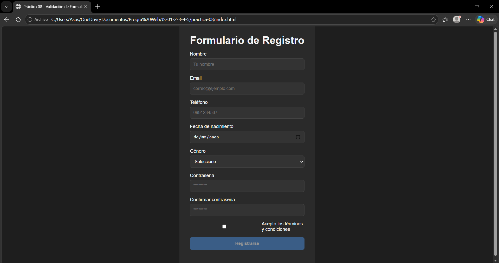
</p>

**Descripción:** El formulario inicia vacío y el botón de envío está deshabilitado para evitar envíos sin datos.

### 2. Errores de validación - Múltiples campos con borde rojo y mensajes específicos
<p align="center">
  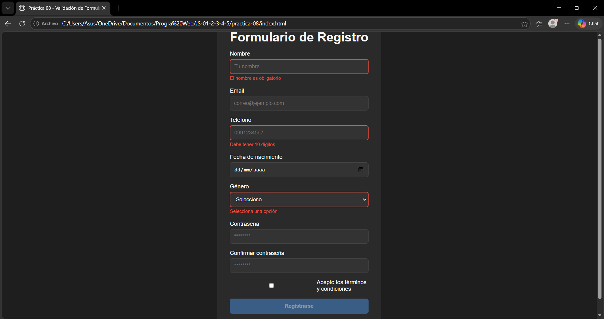
</p>

**Descripción:** Los campos inválidos muestran bordes rojos y mensajes de error indicando qué corregir.

### 3. Campos válidos - Campos con borde verde
<p align="center">
  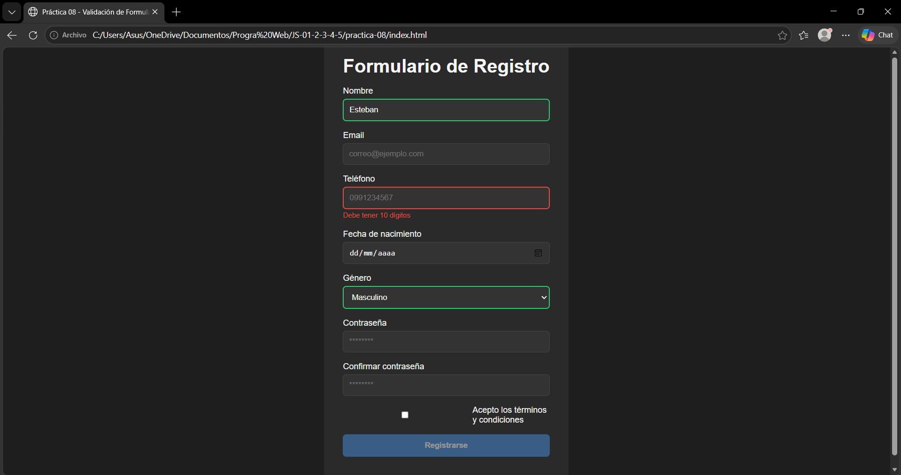
</p>

**Descripción:** Los campos correctos se resaltan con borde verde como feedback positivo.

### 4. Indicador de fuerza de contraseña - Mostrar al menos 3 niveles diferentes
<p align="center">
  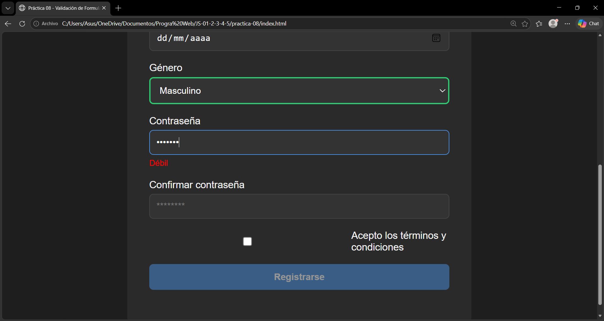
</p>

**Descripción:**  La contraseña cumple minimamente las condiciones de seguridad.

<p align="center">
  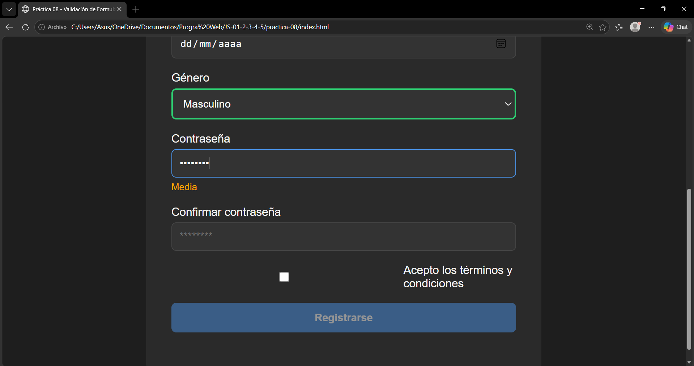
</p>

**Descripción:** La contraseña cumple parcialmente las condiciones de seguridad.

<p align="center">
  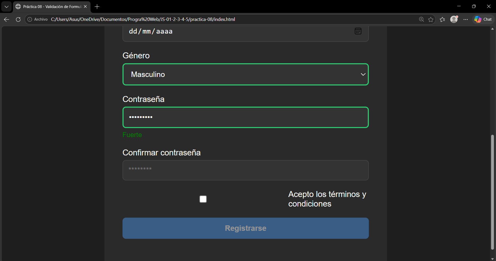
</p>

**Descripción:** La contraseña cumple todas las condiciones de seguridad.

### 5. Error de contraseñas no coinciden - Mensaje en confirmar contraseña
<p align="center">
  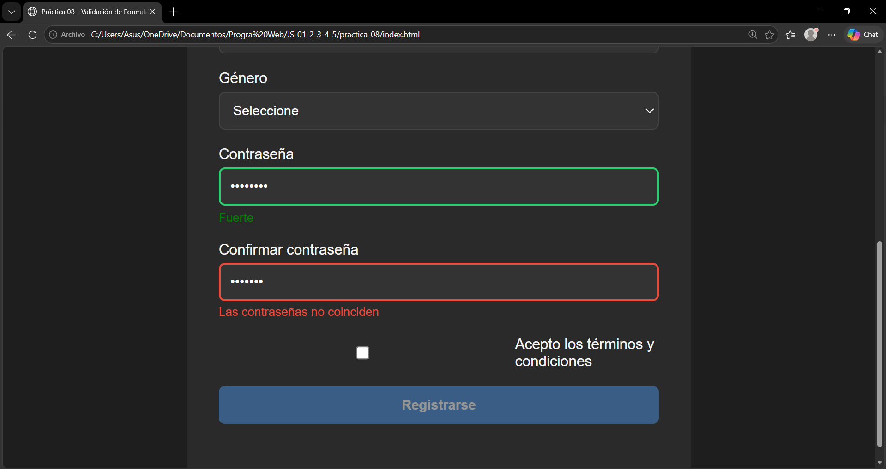
</p>

**Descripción:** Se muestra un error cuando la confirmación no coincide con la contraseña.

### 6. Máscara de teléfono - Formato (099) 999-9999
<p align="center">
  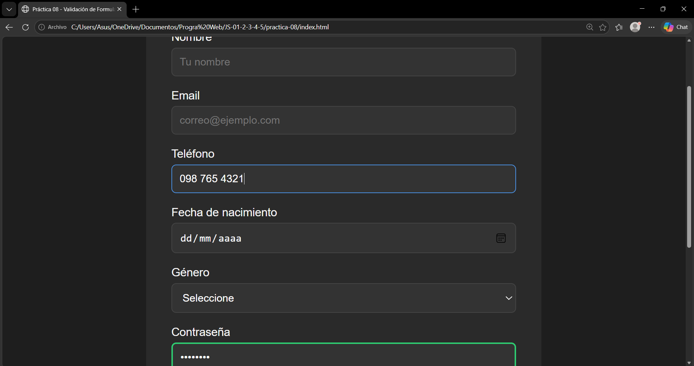
</p>

**Descripción:** El número se formatea automáticamente mientras se escribe con la máscara (099) 999 9999.

### 7. Envío exitoso - Mensaje verde y tarjeta con datos
<p align="center">
  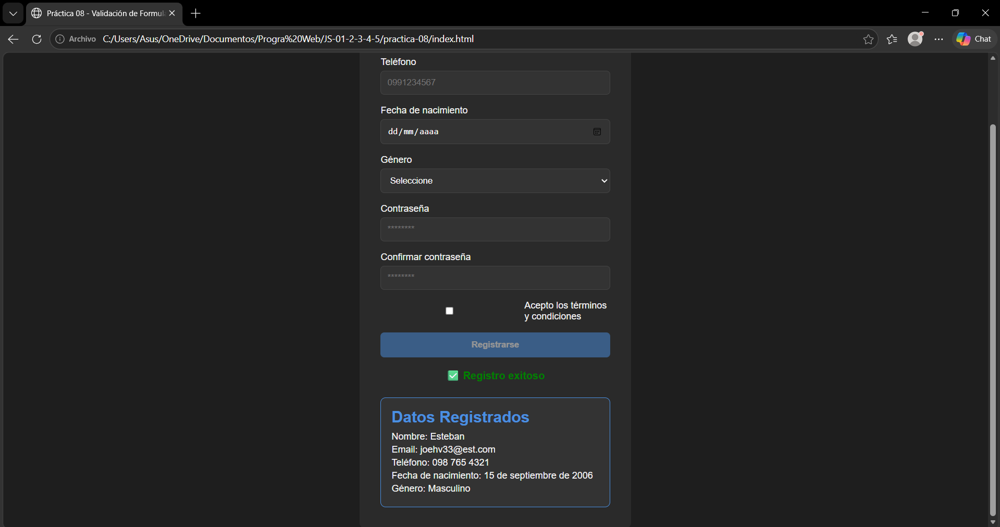
</p>

**Descripción:** Se muestra un mensaje de éxito y se genera una tarjeta con los datos.

### 8. Tarjeta de resultado - Datos formateados correctamente
<p align="center">
  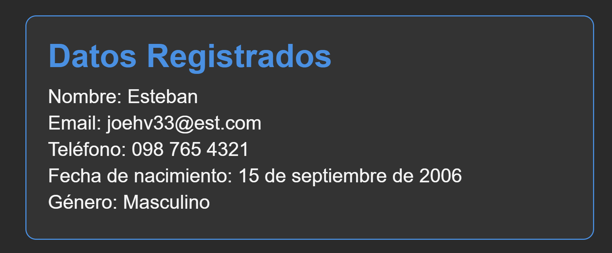
</p>

**Descripción:** Los datos se muestran formateados correctamente como la fecha legible y el género con mayúscula.

### 9. Consola - Datos impresos al enviar
<p align="center">
  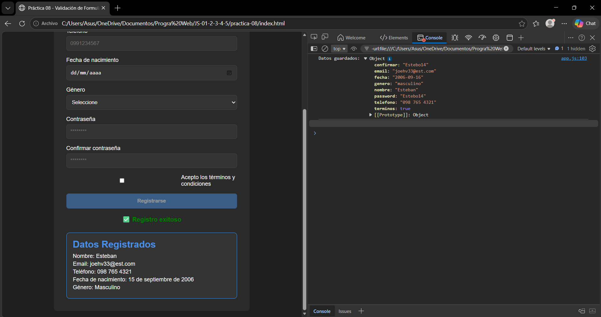
</p>

**Descripción:** Los datos del formulario se imprimen en consola como un objeto.

### 10. Codigo - Capturas de las funciones de validación y componentes
#### 10.1 Validación individual de campos
```javascript
function validarCampo(input) {
  const valor = input.value.trim();
  const id = input.id;

  limpiarError(input);

  switch (id) {
    case 'nombre':
      if (!valor) {
        mostrarError(input, 'El nombre es obligatorio');
        return false;
      }
      if (valor.length < 3) {
        mostrarError(input, 'Debe tener al menos 3 caracteres');
        return false;
      }
      return true;

    case 'email':
      const regexEmail = /^[^\s@]+@[^\s@]+\.[^\s@]+$/;
      if (!valor) {
        mostrarError(input, 'El email es obligatorio');
        return false;
      }
      if (!regexEmail.test(valor)) {
        mostrarError(input, 'Formato de email inválido');
        return false;
      }
      return true;

    case 'telefono':
      const regexTelefono = /^\d{10}$/;
      const limpio = valor.replace(/\D/g, '');

      if (!regexTelefono.test(limpio)) {
        mostrarError(input, 'Debe tener 10 dígitos');
        return false;
      }
      return true;

    case 'fecha':
      if (!valor) {
        mostrarError(input, 'La fecha es obligatoria');
        return false;
      }

      const hoy = new Date();
      const nacimiento = new Date(valor);
      let edad = hoy.getFullYear() - nacimiento.getFullYear();

      const mes = hoy.getMonth() - nacimiento.getMonth();
      if (mes < 0 || (mes === 0 && hoy.getDate() < nacimiento.getDate())) {
        edad--;
      }

      if (edad < 18) {
        mostrarError(input, 'Debes ser mayor de edad');
        return false;
      }
      return true;

    case 'genero':
      if (!valor) {
        mostrarError(input, 'Selecciona una opción');
        return false;
      }
      return true;

    case 'password':
      const regexPass = /^(?=.*[a-z])(?=.*[A-Z])(?=.*\d).{8,}$/;
      if (!regexPass.test(valor)) {
        mostrarError(
          input,
          'Mínimo 8 caracteres, mayúscula, minúscula y número'
        );
        return false;
      }
      return true;

    case 'confirmar':
      const password = document.getElementById('password').value;
      if (valor !== password) {
        mostrarError(input, 'Las contraseñas no coinciden');
        return false;
      }
      return true;

    case 'terminos':
      if (!input.checked) {
        mostrarError(input, 'Debes aceptar los términos');
        return false;
      }
      return true;
  }

  return true;
}
```
**Descripción:** Valida cada campo del formulario de forma independiente según su tipo, aplicando reglas específicas con expresiones regulares además de mostrar errores cuando corresponde.

#### 10.2 Validación completa del formulario
```javascript
function validarFormulario(form) {
  let valido = true;

  const inputs = form.querySelectorAll('input, select');

  inputs.forEach(input => {
    const esValido = validarCampo(input);
    if (!esValido) {
      valido = false;
    }
  });

  return valido;
}
```
**Descripción:** Veriica todos los campos y permite el envío solo si son válidos.

#### 10.3 Validación en tiempo real del formulario
```javascript
function verificarFormularioValido() {
  let valido = true;

  const inputs = form.querySelectorAll('input, select');

  inputs.forEach(input => {
    const valor = input.value.trim();

    switch (input.id) {
      case 'nombre':
        if (!valor || valor.length < 3) valido = false;
        break;

      case 'email':
        const regexEmail = /^[^\s@]+@[^\s@]+\.[^\s@]+$/;
        if (!regexEmail.test(valor)) valido = false;
        break;

      case 'telefono':
        const limpio = valor.replace(/\D/g, '');
        if (limpio.length !== 10) valido = false;
        break;

      case 'fecha':
        if (!valor) valido = false;
        break;

      case 'genero':
        if (!valor) valido = false;
        break;

      case 'password':
        const regexPass = /^(?=.*[a-z])(?=.*[A-Z])(?=.*\d).{8,}$/;
        if (!regexPass.test(valor)) valido = false;
        break;

      case 'confirmar':
        const password = document.getElementById('password').value;
        if (valor !== password) valido = false;
        break;

      case 'terminos':
        if (!input.checked) valido = false;
        break;
    }
  });

  btnSubmit.disabled = !valido;
}
```
**Descripción:** Evalúa continuamente el estado del formulario mientras el usuario interactua con los campos, habilitando o deshabilitando el botón de envío dependiendo de si todos los campos son válidos.

#### 10.4 Mostrar errores en inputs
```javascript
function mostrarError(input, mensaje) {
  const small = input.parentElement.querySelector('.error');
  if (small) small.textContent = mensaje;
  input.classList.add('input-error');
}
```
**Descripción:** Muestra mensajes de error específicos debajo de cada campo y aplica estilos visuales.

#### 10.5 Limpiar errores
```javascript
function limpiarError(input) {
  const small = input.parentElement.querySelector('.error');
  if (small) small.textContent = '';
  input.classList.remove('input-error');
}
```
**Descripción:** Elimina los mensajes de error y estilos visuales cuando el usuario corrige la información ingresada.

#### 10.6 Evaluar fuerza de contraseña
```javascript
function evaluarPassword(password) {
  let fuerza = 0;

  if (password.length >= 8) fuerza++;
  if (/[A-Z]/.test(password)) fuerza++;
  if (/[a-z]/.test(password)) fuerza++;
  if (/\d/.test(password)) fuerza++;

  return fuerza;
}
```
**Descripción:** Analiza la contraseña ingresada verificando criterios de longitud, uso de mayúsculas, minúsculas y números, retornando un valor que representa su nivel de seguridad.

#### 10.7 Mostrar indicador de contraseña
```javascript
function mostrarFuerzaPassword(input) {
  let indicador = input.parentElement.querySelector('.password-strength');

  if (!indicador) {
    indicador = document.createElement('div');
    indicador.className = 'password-strength';
    input.parentElement.appendChild(indicador);
  }

  const fuerza = evaluarPassword(input.value);

  if (!input.value) {
    indicador.textContent = '';
    return;
  }

  if (fuerza <= 2) {
    indicador.textContent = 'Débil';
    indicador.style.color = 'red';
  } else if (fuerza === 3) {
    indicador.textContent = 'Media';
    indicador.style.color = 'orange';
  } else {
    indicador.textContent = 'Fuerte';
    indicador.style.color = 'green';
  }
}
```
**Descripción:** Genera dinámicamente un indicador visual que muestra si la contraseña es débil, media o fuerte.

#### 10.8 Formatear teléfono (máscara)
```javascript
function formatearTelefono(valor) {
  valor = valor.replace(/\D/g, '').substring(0, 10);

  if (valor.length > 6) {
    return `${valor.slice(0,3)} ${valor.slice(3,6)} ${valor.slice(6)}`;
  } else if (valor.length > 3) {
    return `${valor.slice(0,3)} ${valor.slice(3)}`;
  }
  return valor;
}

document.getElementById('telefono').addEventListener('input', (e) => {
  e.target.value = formatearTelefono(e.target.value);
});
```
**Descripción:** Limpia el valor ingresado eliminando caracteres no numéricos y aplica automáticamente un formato estructurado al número mientras el usuario lo ingresa.

#### 10.9 Crear tarjeta de usuario
```javascript
function crearTarjetaUsuario(datos) {
  const card = document.createElement('div');
  card.className = 'card-usuario';

  const titulo = document.createElement('h2');
  titulo.textContent = 'Datos Registrados';

  const nombre = document.createElement('p');
  nombre.textContent = `Nombre: ${datos.nombre}`;

  const email = document.createElement('p');
  email.textContent = `Email: ${datos.email}`;

  const telefono = document.createElement('p');
  telefono.textContent = `Teléfono: ${datos.telefono}`;

  const fecha = document.createElement('p');
  fecha.textContent = `Fecha de nacimiento: ${formatearFecha(datos.fecha)}`;

  const genero = document.createElement('p'); 
  genero.textContent = `Género: ${capitalizar(datos.genero)}`;

  card.appendChild(titulo);
  card.appendChild(nombre);
  card.appendChild(email);
  card.appendChild(telefono);
  card.appendChild(fecha);
  card.appendChild(genero);

  return card;
}
```
**Descripción:** Construye dinámicamente una tarjeta utilizando `createElement` para mostrar datos del usuario de forma organizada y legible.

#### 10.10 Formatear fecha
```javascript
function formatearFecha(fechaISO) {
  const fecha = new Date(fechaISO);

  return fecha.toLocaleDateString('es-ES', {
    day: 'numeric',
    month: 'long',
    year: 'numeric'
  });
}
```
**Descripción:** Convierte una fecha en formato ISO a un formato largo y legible en español.

#### 10.11 Formatear género
```javascript
function capitalizar(texto) {
  if (!texto) return '';
  return texto.charAt(0).toUpperCase() + texto.slice(1);
}
```
**Descripción:** Transforma el texto del género para que la primera letra sea mayúscula.